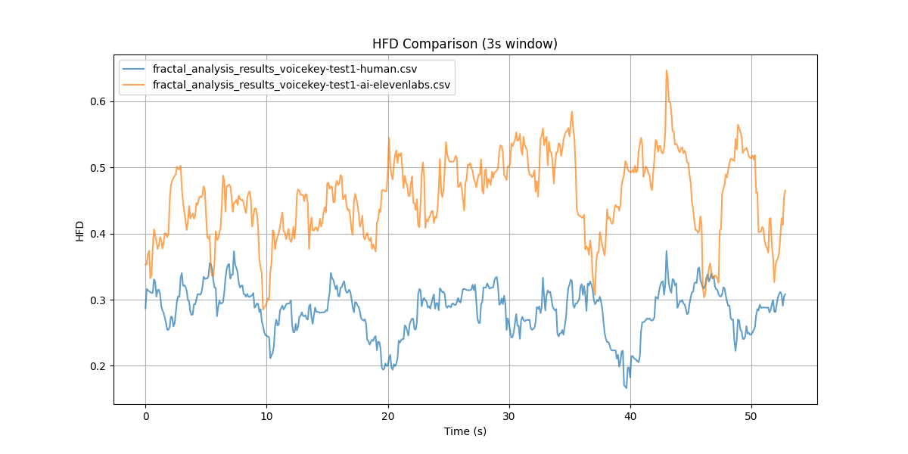

# Fractal Analysis for VoiceKey

## An Open-Source Research Project in Support of AI Integrity Alliance

## Project Overview

This open-source research project focuses on developing and refining Fractal Voice Analysis techniques to distinguish between human and AI-generated voices. The project is a key component of the VoiceKey initiative, conducted in support of the AI Integrity Alliance's (AI²) mission to create robust methods for voice authenticity verification in an era of advancing AI voice synthesis technologies.

### Key Features

- Implements Higuchi Fractal Dimension (HFD) analysis on voice recordings
- Utilizes Detrended Fluctuation Analysis (DFA) for long-range correlation detection
- Provides a flexible Python script for analyzing .wav audio files
- Includes adaptive thresholding for human/AI voice classification
- Generates visual representations of fractal dimensions over time

## Understanding HFD and DFA

### Analysis Methods

- HFD: The Higuchi Fractal Dimension measures how complex and detailed a signal is at different scales.
- DFA: Detrended Fluctuation Analysis looks at how a signal's patterns repeat over time, even when the overall trend is removed.

### Application of Methods

The Higuchi Fractal Dimension (HFD) and Detrended Fluctuation Analysis (DFA) are both techniques used to analyze the complexity and patterns in time series data, such as audio signals. HFD quantifies the irregularity and self-similarity of a signal across different time scales, providing a measure of its fractal-like properties. DFA examines long-range correlations in the signal by analyzing how fluctuations in the data change with the observation window size, after removing overall trends.

In our voice analysis project, we use adaptive thresholds for both HFD and DFA to distinguish between human and AI-generated voices. Our approach focuses on detecting the lack of randomness in AI-generated voices, which aligns with our initial thesis. Our findings suggest that AI-generated voices tend to exhibit higher HFD and DFA values, indicating more repetitive fractal patterns and stronger long-range correlations. Human voices, on the other hand, demonstrate lower thresholds of these measures, suggesting more randomness and less predictable patterns.

This result supports our hypothesis and highlights the effectiveness of using fractal analysis to detect AI-generated voices by identifying their lack of natural variability. It suggests that AI-generated voices are more prone to repeating certain fractal patterns, while human voices exhibit a greater degree of natural variability and randomness.

## Recent Findings: Human vs AI-Generated Audio Comparison

We've conducted an exploratory analysis comparing fractal characteristics of human and AI-generated audio samples. Key findings include:

1. AI-generated audio showed consistently higher HFD values, indicating more repetitive fractal patterns in the signal.
2. AI-generated audio exhibited slightly higher DFA values, suggesting stronger long-range correlations.
3. AI audio demonstrated more variability in both HFD and DFA measures throughout the samples, possibly due to the diverse range of AI models and techniques used in generation.
4. Human voice samples showed lower HFD and DFA values, indicating more randomness and less predictable patterns.

These findings are preliminary and based on a limited sample size. They support our initial thesis about the fractal properties of human and AI-generated voices, emphasizing the potential of our approach in distinguishing between the two. For a detailed analysis, including visualizations and future research directions, please refer to our [Fractal Analysis Comparison](fractal_analysis_comparison.md) document.




## The Rationale Behind Our Approach

Our approach to voice authentication is grounded in several key principles that leverage computational asymmetry and the inherent complexity of human voice patterns. Here's why we believe this approach is effective:

### Computational Asymmetry as a Security Cornerstone

The foundation of our security model lies in computational asymmetry. While the verification process is computationally intensive but feasible, evasion of the system is designed to be computationally infeasible. This concept is similar to principles used in cryptocurrency mining and password hashing algorithms, where verification is possible but reverse-engineering or bypassing the system requires astronomical computational resources.

### Security Through Complexity

By employing complex fractal analysis methods like HFD and DFA across multiple time scales, we create a multi-dimensional problem space. This complexity significantly increases the challenge for any adversary attempting to create a convincing fake voice. The intricate nature of these analyses makes it extremely difficult to reverse-engineer or predict the exact characteristics that would pass as a human voice.

### Time as a Critical Security Factor

Our system is designed so that while analysis may take hours, potential evasion could take years or even centuries. This substantial time factor creates a critical security buffer, maintaining the system's integrity against advancing computational capabilities. As technology progresses, this time-based security continues to be a formidable barrier against potential attacks.

### Scalable Security Model

As computational power increases over time, our approach allows for scaling up the complexity of our analysis. We can potentially increase window sizes, introduce more intricate fractal measures, or add additional layers of analysis. This scalability ensures that we can maintain the computational gap between verification and evasion, future-proofing our security model.

### Alignment with VoiceKey Philosophy

This approach aligns perfectly with the VoiceKey project's focus on leveraging the unique randomness properties of human voices. These properties are inherently difficult for AI to replicate, making our system robust against current and future AI-based attacks.

### Optimization and Future Potential

While our current focus is on proving the concept, there is significant potential for future optimization:

1. **Proof of Concept Priority**: We're currently focused on validating the approach before investing in optimization. This allows us to ensure the fundamental security model is sound.

2. **Future Optimization Potential**: Once the concept is proven, we can explore various optimization strategies. These could include algorithm refinements, implementation of parallel processing, or leveraging specialized hardware, all without compromising the core security model.

3. **Adaptive Complexity**: In the future, we could design the system to dynamically adjust its computational intensity based on current technological capabilities. This would ensure that the system always stays ahead of potential evasion techniques.

Our perspective on "compute expenditure as security" creates a system where the very act of trying to evade it becomes a deterrent due to the astronomical computational resources required. This approach not only provides robust security but also offers a scalable and future-proof solution for voice authentication.

## Getting Started

### Prerequisites

- Python 3.7+
- pip (Python package manager)

### Installation

1. Clone this repository:
   ```
   git clone https://github.com/AI-Integrity-Alliance/fractal-voice-analysis.git
   cd fractal-voice-analysis
   ```

2. Install required packages:
   ```
   pip install numpy librosa matplotlib tqdm pandas scipy
   ```

### Usage

Run the script from the command line, providing the path to your audio file:

```
python fractal_voice_analysis.py path/to/your/audio_file.wav
```

The script will analyze the audio file and output:
- A classification (human or AI-generated voice)
- The average fractal dimension
- A plot of fractal dimensions over time (saved as 'fractal_analysis_result.png')
- A CSV file with detailed analysis results

## How It Works

1. **Audio Loading**: The script loads the first 60 seconds of the provided .wav file.
2. **Multi-scale Analysis**: It applies a sliding window approach to calculate HFD and DFA across the audio signal at various time scales.
3. **Adaptive Thresholding**: The system determines adaptive thresholds based on the distribution of HFD and DFA values.
4. **Classification**: The average fractal dimensions are compared against the adaptive thresholds to classify the voice as human or AI-generated.
5. **Visualization**: Results are plotted and saved as an image file for further analysis.

## Test Narrative

To properly test with your own voice or have AI read it, please refer to the test narrative available at: [VoiceKey Test Narrative](voicekey-test-narrative.md)

## Future Work and Crowdsourcing Initiative

While our initial results are promising, there is still significant work to be done to refine and validate our approach. The computationally expensive nature of our analysis (taking hours per sample) necessitates a crowdsourcing approach to advance our research. We are calling on the community to help with:

1. **Sample Collection**: We need a diverse range of human and AI-generated voice samples to improve the robustness of our analysis.

2. **Threshold Modifications**: Help us fine-tune the adaptive thresholds for HFD and DFA to improve classification accuracy.

3. **Detection Analysis**: Contribute to the exploration of various time series analysis techniques and fractal dimension definitions to enhance our detection capabilities.

By leveraging the power of crowdsourcing, we aim to accelerate the development of this promising approach to voice authentication. If you're interested in contributing, please check our [Contributing Guidelines](https://ai2-alliance.github.io/VoiceKey/docs/collaboration.html) for more information on how to get involved.

## VoiceKey Project

VoiceKey is a research initiative aimed at developing a robust voice authentication system leveraging the unique randomness properties of the human voice. It utilizes negative detection, Zero-Knowledge Proofs (ZKPs), blockchain technology, and analog voice verification to create a secure, privacy-preserving, and computationally efficient authentication mechanism. [VoiceKey Project Overview](https://ai2-alliance.github.io/VoiceKey/)

Key aspects of VoiceKey include:
- Negative detection of AI-generated voices
- Integration of Multi-Factor Authentication (MFA) and biometric factors
- Privacy preservation using ZKP and blockchain technology
- Analysis of compute resource expenditures and bypass probabilities
- Consideration of potential bypass methodologies and security measures

## AI Integrity Alliance (AI²)

The AI Integrity Alliance (AI²) is a global coalition dedicated to promoting ethical and trustworthy artificial intelligence. Its mission is to ensure AI technologies are developed and used responsibly, transparently, and inclusively. AI² unites representatives from diverse regions, industries, and cultures to foster collaboration and share best practices in AI ethics.

Core Principles of AI²:
1. Transparency and Accountability
2. Inclusion and Diversity
3. Open-Source Empowerment

## License

This project is licensed under the MIT License - see the [LICENSE](LICENSE) file for details.

## Disclaimer

This project is a research initiative and should not be considered a definitive method for distinguishing human from AI-generated voices. The effectiveness of this approach may vary and is subject to ongoing research and refinement.

## Acknowledgments

- This project is conducted in support of the [AI Integrity Alliance](https://ai2.ngo) 
- Special thanks to all contributors and researchers in the field of audio signal processing and fractal analysis

## Contact

For inquiries about this project or the AI Integrity Alliance, please contact:
[info@ai2.ngo](mailto:info@ai2.ngo)

---

**Note**: This README is part of an ongoing research project. Methods and results are subject to change as research progresses.
