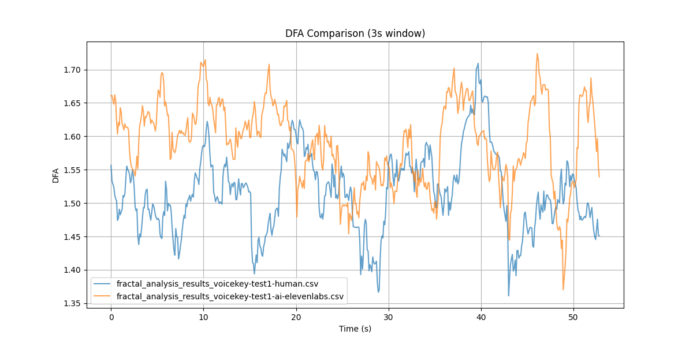

# Fractal Analysis Comparison: Human vs AI-Generated Audio

## Introduction

This document presents an exploratory analysis comparing fractal characteristics of human and AI-generated audio samples. The analysis uses two main measures: Higuchi Fractal Dimension (HFD) and Detrended Fluctuation Analysis (DFA). It's important to note that this is an initial exploration and further research with larger sample sizes and refined methodologies is needed to draw definitive conclusions.

## Methodology

We compared two audio samples:
1. Human-generated audio (fractal_analysis_results_voicekey-test1-human.csv)
2. AI-generated audio (fractal_analysis_results_voicekey-test1-ai-elevenlabs.csv)

The analysis was performed using 1-second and 3-second windows for both HFD and DFA measures.

## Results

### 1. Higuchi Fractal Dimension (HFD)

#### 1-second window:
- Human: mean = 0.2911, std = 0.0832, range = [0.0877, 0.5529]
- AI: mean = 0.4433, std = 0.1357, range = [0.1063, 0.9022]

#### 3-second window:
- Human: mean = 0.2852, std = 0.0362, range = [0.1663, 0.3736]
- AI: mean = 0.4544, std = 0.0622, range = [0.2850, 0.6464]

### 2. Detrended Fluctuation Analysis (DFA)

#### 1-second window:
- Human: mean = 1.5017, std = 0.1267, range = [1.0331, 1.7733]
- AI: mean = 1.5839, std = 0.1317, range = [1.0356, 1.8650]

#### 3-second window:
- Human: mean = 1.5159, std = 0.0602, range = [1.3611, 1.7092]
- AI: mean = 1.5898, std = 0.0618, range = [1.3700, 1.7239]

## Analysis

1. **Complexity (HFD)**: The AI-generated audio consistently shows higher HFD values, indicating more complexity or randomness in the signal. The AI audio also has a wider range and higher standard deviation, suggesting more variability in complexity.

2. **Long-range Correlations (DFA)**: The AI-generated audio shows slightly higher DFA values, indicating somewhat stronger long-range correlations in the signal. The differences are less pronounced than in the HFD analysis but still consistent across both window sizes.

3. **Variability**: The AI audio shows more variability in both measures, especially in the HFD analysis. This could suggest that the AI-generated audio has more diverse acoustic properties throughout the sample.

4. **Window Size Effect**: The 3-second window analysis shows less variability (lower std) than the 1-second window for both human and AI audio. This suggests that longer time scales might provide more stable measurements of fractal characteristics in audio signals.

## Conclusions and Future Directions

This exploratory analysis reveals notable differences between human and AI-generated audio in terms of their fractal characteristics. The AI-generated audio appears to have higher complexity and slightly stronger long-range correlations, with more variability in these measures throughout the sample.

However, it's crucial to emphasize that these findings are based on a limited sample and should be considered preliminary. Future research directions could include:

1. Analyzing a larger dataset of both human and AI-generated audio samples to ensure the observed patterns are consistent.
2. Investigating the impact of different AI models and generation parameters on the fractal characteristics of the output.
3. Exploring the perceptual correlates of these fractal measures – do the differences in HFD and DFA correspond to noticeable differences in how humans perceive the audio?
4. Refining the classification method to better understand the nature of the differences between human and AI-generated audio.
5. Investigating how these fractal measures correlate with other audio features and quality metrics.

By pursuing these directions, we can develop a more comprehensive understanding of the differences between human and AI-generated audio, potentially leading to improved AI models and better methods for detecting AI-generated content.
